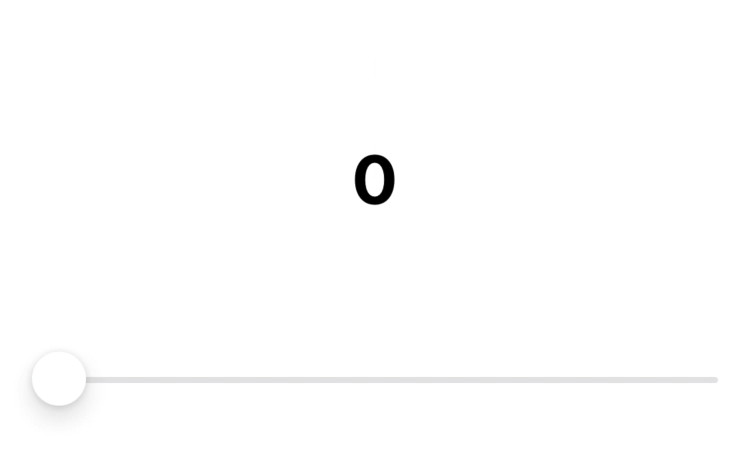
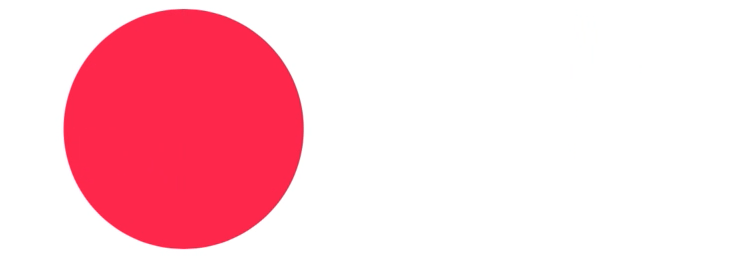

[](https://swift.org)
[](https://developer.apple.com/swift/)
[](https://swift.org/package-manager/)
[](https://tldrlegal.com/license/mit-license)
[](https://twitter.com/__pyroh)

# Animated

`Animated` is a function mimicking a SwiftUI container that presents one or more animated values to a view tree.  
Basically it allows you to animate views without implementing  `AnimatableModifier`.

## Installation
`Animated` is available through the Swift Package Manager. Add this to your `Package.swift` file :
```Text
dependencies: [
    // Dependencies declare other packages that this package depends on.
    ...
    .package(url: "https://github.com/Pyroh/Animated", .upToNextMajor(from: "0.2.0")),
    ...
],
```
Alternatively you can add the code directly in your own code.

## Usage
> DISCLAIMER: In order to make these samples work as previews in Xcode they are wrapped in what seems to be a useless `VStack`. It's not needed to run on simulator or on device. 

You use  `Animated` like you'd use any other SwiftUI container may it be a `VStack`, `HStack` or whatever.
To achieve this astonishing animation you don't need much code.


```Swift
struct VariablePie: View {
    @State private var value: Double = 0

    var body: some View {
        VStack {
            Animated(value) { value in
                Text(verbatim: String(Int(value)))
                .bold()
                .font(Font.largeTitle.monospacedDigit())
                .frame(width: 120, height: 120)
                .background(PieShape(completion: value / 100).fill(Color.orange))
            }
            .onAppear {
                withAnimation(Animation.easeOut(duration: 3.33).repeatForever()) {
                    self.value = 100
                }
            }
        }
    }
}
```

Just tell `Animated` what variable could animate at some point and write your code like you'd normally do. You don't have to worry about the actual animation.

## Using `Binding<...>` variables
Sometimes you need to pass a binding to a view, `Animated` got you covered as well.



```Swift
struct VariableSlider: View {
    @State private var value: Double = 0

    var body: some View {
        VStack {
            Animated($value) { value in
                VStack {
                    Text(verbatim: String(Int(value.wrappedValue)))
                        .bold()
                        .font(Font.largeTitle.monospacedDigit())
                        .frame(width: 120, height: 120)
                        .background(PieShape(completion: value.wrappedValue / 100).fill(Color.orange))
                    Slider(value: value, in: 0...100)
                }.padding()
            }
            .onAppear {
                withAnimation(Animation.easeOut(duration: 3.33).repeatForever()) {
                    self.value = 100
                }
            }
        }
    }
}
```

## Using non-animatable values
Not all values are animatable. That's where `TransformAnimated` come in handy. It accepts the arguments `Animated` accepts and two closures. One converts the non-animatable value to an animatable one and the second one converts the value back.  
Here we also animate a color as well as a value :


```Swift
struct ColoredVariablePie: View {
    @State private var value: Double = 0
    @State private var color: UIColor = .systemBlue

    var body: some View {
        VStack {
            Animated(value) { value in
                TransformAnimated(self.color, transform: self.colorTransform(_:), revert: self.colorRevert(_:_:)) { color in
                    Text(verbatim: String(Int(value)))
                        .bold()
                        .font(Font.largeTitle.monospacedDigit())
                        .frame(width: 120, height: 120)
                        .background(PieShape(completion: value / 100).fill(Color.init(color)))
                }
            }
            .onAppear {
                withAnimation(Animation.easeOut(duration: 3.33).repeatForever()) {
                    self.color = .systemOrange
                    self.value = 100
                }
            }
        }
    }

    func colorTransform(_ color: UIColor) -> AnimatablePair<AnimatablePair<CGFloat, CGFloat>, AnimatablePair<CGFloat, CGFloat>> {
        var p = UnsafeMutablePointer<CGFloat>.allocate(capacity: 4)
        defer { p.deallocate() }
        color.getHue(p, saturation: p+1, brightness: p+2, alpha: p+3)

        return .init(.init(p[0], p[1]), .init(p[2], p[3]))
    }

    func colorRevert(_ comps: AnimatablePair<AnimatablePair<CGFloat, CGFloat>, AnimatablePair<CGFloat, CGFloat>>, _ color: UIColor) -> UIColor {
        .init(hue: comps.first.first, saturation: comps.first.second, brightness: comps.second.first, alpha: comps.second.second)
    }
}
```

## Animating more than one value

Although you can nest `Animated` calls convenient multi-arguments `Animated` also exist and allow up to four arguments regardless of the arguments being a `V` or a `Binding<V>`.   



```Swift
struct AnimatedSample3: View {
    @State private var p1: CGFloat = 1
    @State private var p2: CGFloat = 0

    var body: some View {
        VStack {
            Animated(p1, p2) { p1, p2 in
                RoundedRectangle(cornerRadius: 8)
                    .foregroundColor(.pink)
                    .frame(width: 300 * p1, height: 50)
                RoundedRectangle(cornerRadius: 8)
                    .foregroundColor(.orange)
                    .frame(width: 300 * p2, height: 50)
            }
        }
        .onAppear {
            withAnimation(Animation.spring().repeatForever(autoreverses: true)) {
                self.p1 = 0
                self.p2 = 1
            }
        }
    }
}
```

### Why only four arguments ?
The `Animated` function accepts an argument of type `V` that implements either `VectorArithmetic` or `Animatable`. Additionally the argument can also be a `Binding<V>`.  
The only way to do this is to duplicate the `Animated` function for every cases :

```Swift
func Animated<V: VectorArithmetic, Content: View>(_ value: V, @ViewBuilder content: @escaping (V) -> Content) -> some View
func Animated<V: Animatable, Content: View>(_ value: V, @ViewBuilder content: @escaping (V) -> Content) -> some View
func Animated<V: VectorArithmetic, Content: View>(_ binding: Binding<V>, @ViewBuilder content: @escaping (Binding<V>) -> Content) -> some View
func Animated<V: Animatable, Content: View>(_ binding: Binding<V>, @ViewBuilder content: @escaping (Binding<V>) -> Content) -> some View
```

If you want `Animated` to accept *n* arguments you must write 2<sup>2*n*</sup> variations. This package offers a generator script so nobody has to actually write these variation.  
Why not already shipping up to 10, 20 arguments enabled `Animated` ? Because of this 2<sup>2*n*</sup> thing. Five arguments require 2<sup>10</sup> variations (1024) and Xcode is already showing some signs of weakness.  
In the end you can generate anything you need and add it to your own project. But remember that sometimes nesting function is not that terrible.

## License
See LICENSE.
